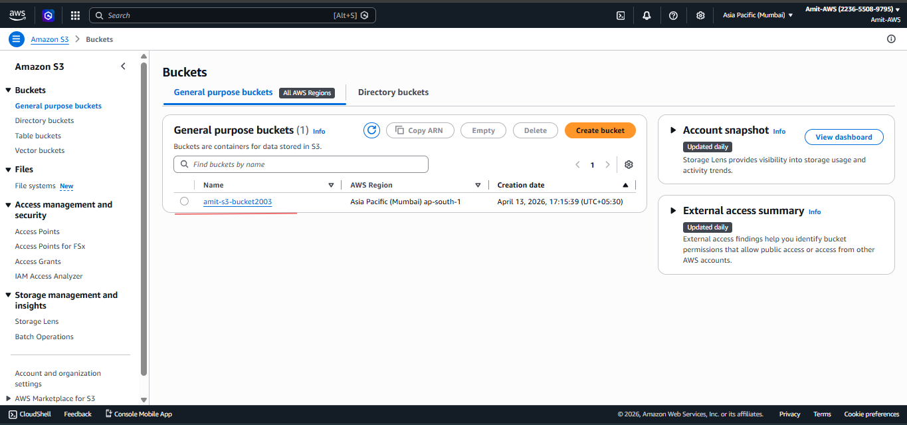
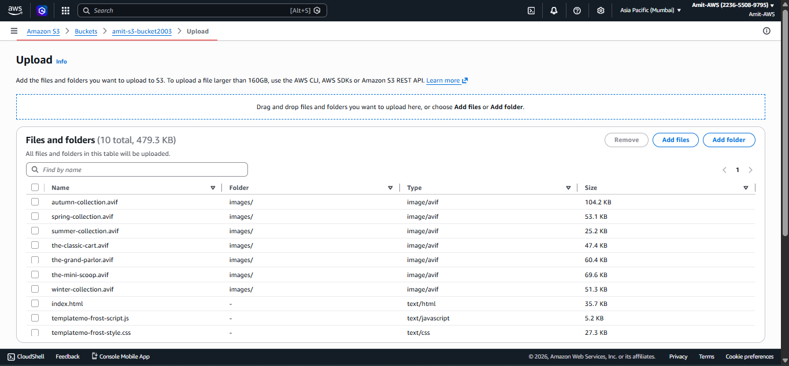
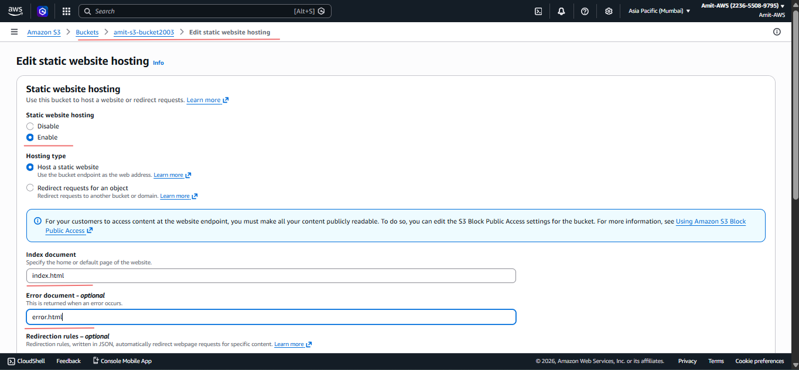
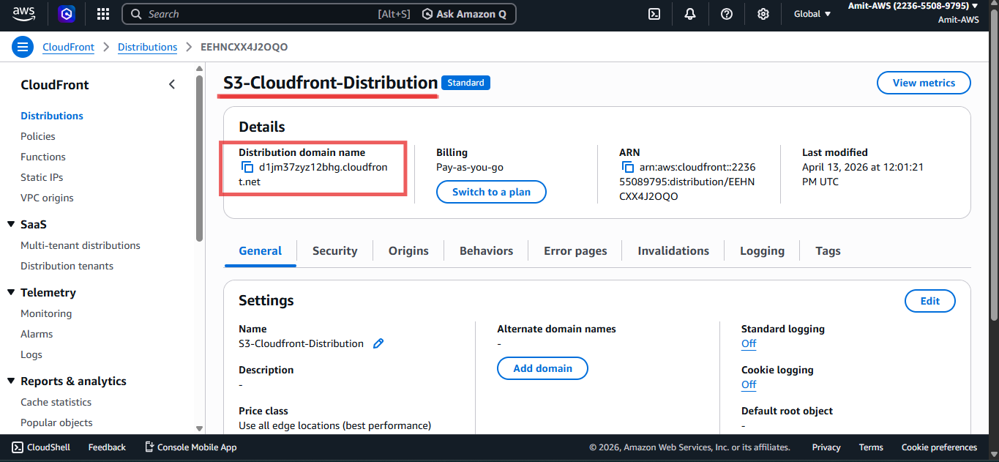
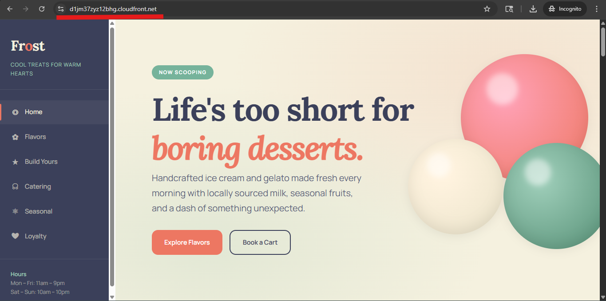

#  AWS CDN Project (S3 + CloudFront)

##  Overview
This project demonstrates how to host a static website using Amazon S3 and deliver it globally using CloudFront CDN for faster performance and secure access.

---

##  Architecture
User → CloudFront → S3 Bucket

---

##  Services Used
- Amazon S3 (Static Website Hosting)
- Amazon CloudFront (CDN)

---

##  Steps

1. Created an S3 bucket with a  name " amit-s3-bucket2003 " 
2. Uploaded static website files ( index.HTML, CSS template)  
3. Enabled static website hosting  
4. Configured index.html and error.html  
5. Added bucket policy for public access  
6. Accessed website using S3 endpoint  
7. Created CloudFront distribution  
8. Selected S3 as origin (website endpoint)  
9. Accessed website using CloudFront URL  

---

##  Security

- Disabled public access to S3 bucket  
- Accessed content through CloudFront  

---

## ⚡ Features
- Fast content delivery using CDN  
- Reduced latency  
- High availability  
- Secure access  

---

## 📷 Screenshots
   

### S3 Bucket

### Uploaded Files

### Static Website Hosting

### S3 Website Output

### CloudFront Distribution

### CloudFront Output

---

## 📈 Future Improvements
- Add custom domain  
- Enable HTTPS (SSL)  
- Use Origin Access Control (OAC)  
- Add monitoring  

---

## 🎯 Learning
- Learned CDN concept  
- Worked with S3 static hosting  
- Configured CloudFront distribution  

---

## 👨‍💻 Author
Amit Mishra   
https://github.com/AmitMishra9650
